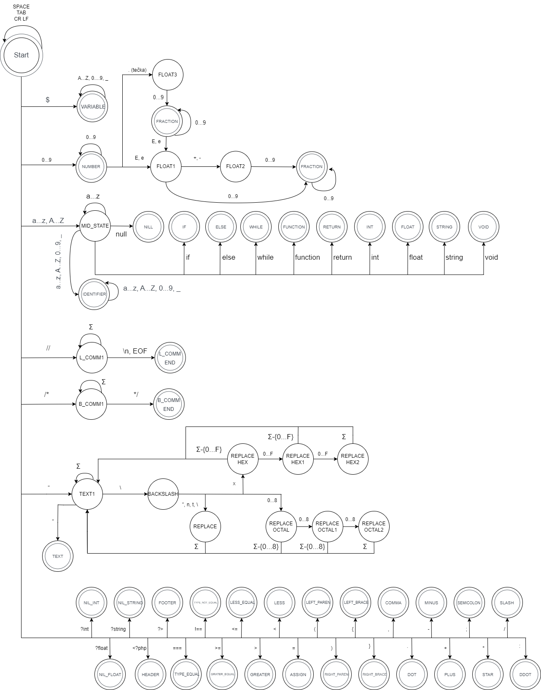
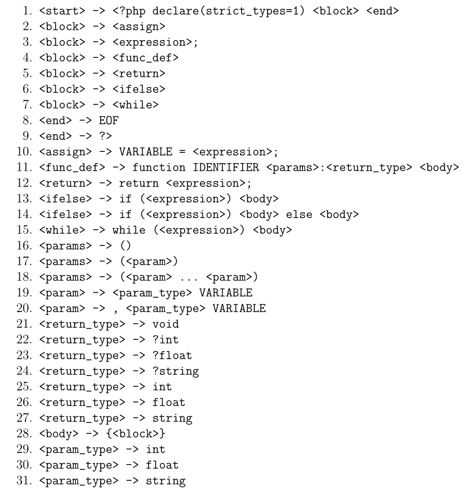
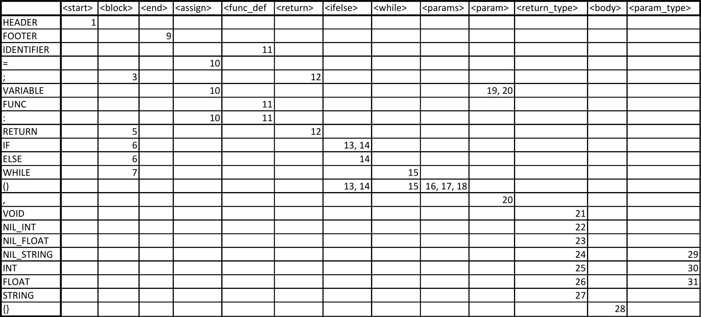
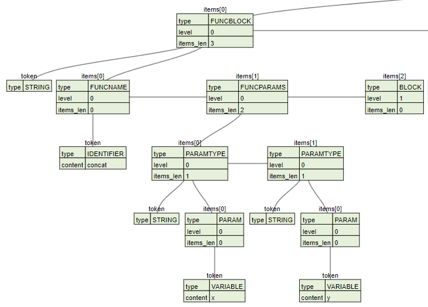

# IFJ-Projekt-Compiler

### Obsah

- [Úvod](#úvod)
- [Implementace](#implementace)
    - [Lexikální analýza](#lexikální-analýza)
    - [Syntaktická analýza](#syntaktická-analýza)
    - [Sémantická analýza](#sémantická-analýza)
    - [Generování cílového kódu](#generování-cílového-kódu)
    - [Testování](#testování)
- [Dynamické datové struktury](dynamické-datové-struktury)
    - [Posuvný buffer](#posuvný-buffer)
    - [Pole tokenů](#posuvný-buffer)
    - [Strom výrazů](#strom-výrazů)
    - [Syntaktický strom](#syntaktický-strom)
    - [Tabulka symbolů](#tabulka-symbolů)
- [FSM specifikující lexikální analyzátor](#diagram-konečného-automatu-specifikující-lexikální-analyzátor)
- [LL Gramatika](#ll-gramatika)
- [LL Tabulka](#ll-tabulka)
- [Precedenční tabulka](#precedenční-tabulka)
- [Ukázka stromu](#ukázka-stromu)

### Autoři

| Člen týmu          | Pridelená práca                                            |
| ------------------ | ---------------------------------------------------------- |
| Nikolas Nosál      | Tabulka symbolů, Generování kódu, Syntaktická analýza      |
| Adam Mrkva         | Ošetření chyb, Generování kódu                             |
| Rostislav Navrátil | Lexikální analýza, Syntaktická analýza, Sémantická analýza |
| David Nevrlka      | Sémantická analýza, Dokumentace, Prezentace                |

### Členění implementačního řešení

|                                 |                                                          |
| ------------------------------- | -------------------------------------------------------- |
| Funkce main                     | `ifj22_compiler.c`                                       |
| Lexikální analyzátor            | `lex.c`, `lex.h`                                         |
| Syntaktický analyzátor          | `parser.c`, `parser.h`, `expr_parser.c`, `expr_parser.h` |
| Sémantický analyzátor           | `semantic_analyzer.c`, `semantic_analyzer.h`             |
| Generování kódu                 | `code_generation.c`, `code_generation.h`                 |
| Posuvný buffer                  | `strings_lib.c`, `strings_lib.h`                         |
| Pole tokenů                     | `tokens_lib.c`, `tokens_lib.h`                           |
| Strom výrazů                    | `expr_tree.c`, `expr_tree.h`                             |
| Syntaktický strom               | `syntax_tree.c`, `syntax_tree.h`                         |
| Tabulka symbolů                 | `symtable.c`, `symtable.h`                               |
| Posuvný buffer a pomocné funkce | `string_lib.c`, `string_lib.h`                           |
| Ošetření chyb                   | `error_handler.c`, `error_handler.h`                     |
| Zásobník                        | `stack_lib.c`, `stack_lib.h`                             |

 

## Úvod
Cílem projektu bylo vytvořit program v jazyce C, který načte zdrojový kód v jazyce IFJ22, jenž je zjednodušenou podmnožinou jazyka PHP a následně jej přeloží do cílového jazyka IFJcode22. Jako tým jsme zvolili variantu TRP (Implementace tabulky symbolů pomocí tabulky s  rozptýlenými položkami).

 

## Implementace

V této kapitole je popsána implementace jednotlivých částí, které na sebe navazují a tvoří tak spolu výsledný překladač. 

### Lexikální analýza
Základním modulem lexikální analýzy je scanner. Tento scanner je implementován podle deterministického konečného stavového automatu. Diagram automatu je na [(Obrázku 1)](#diagram-konečného-automatu-specifikující-lexikální-analyzátor). Většina lexikálního analyzátoru se nachází v souborech `lex.c` a `lex.h` a jeho pomocné funkce se nachází v souborech `string_lib.c` a `string_lib.h`. 

Hlavní je funkce `lex_tokenize`, která přečte zdrojový soubor a převádí jej na tokeny a ukládá je do pole tokenů. Při procházení zdrojového souboru je využit posuvný buffer, který umožňuje nahlížet dopředu. Tokeny obsahují typ, řádek, sloupec a obsah. Chyby jsou ošetřeny pomocí funkce `lex_error`, která vypisuje chybovou hlášku, řádek a obsah bufferu na místě chyby.

### Syntaktická analýza
Syntaktická analýza se řídí LL-gramatikou [(Tabulka 1)](#ll-gramatika) a metodou rekurzivního sestupu. Je implementována v souborech `parser.c`, `parser.h`, `expr_parser.c`, `expr_parser.h`, `syntax_tree.c` a `syntax_tree.h`. Analýza je rozdělena na parsování výrazů a parsování všeho ostatního. Syntaktický analyzátor postupně prochází pole tokenů, pokud u tokenu nenalezne chybu, staví abstraktní syntaktický strom podle LL-gramatiky. Při vývoji jsme tento strom převáděli do textového formátu JSON a poté vizualizovali pomocí nástroje **[vtree](https://vanya.jp.net/vtree/)**, (Ukázka na [Obrázku 2](#ukázka-stromu)). Výrazy jsou parsovány pomocí funkce `expr_parse`, která vrací strom výrazů a ten je poté připojen do syntaktického stromu. Chyby jsou ošetřeny pomocí funkce `syntax_error`, která vypisuje chybovou hlášku a obsah daného tokenu.

### Sémantická analýza
Sémantická analýza je implementována v souborech `semantic_analyzer.c` a `semantic_analyzer.h` a je založena na rekurzivním volání funkce `rec_check_types`. Nicméně hlavní funkce analýzy je `analyze_ast`. Funkce nejdříve prochází hlavičky funkcí, poté těla funkcí a nakonec blok kódu programu, všechno se zapisuje do tabulky symbolů. Pro každou funkci a blok kódu programu se vytváří nová tabulka symbolů, která se po analyzování dané funkce/bloku programu ruší. Tyto tabulky používáme 2. První uchovává proměnné a druhá funkce. Tabulky slouží primárně k referenci. Chyby jsou ošetřeny pomocí funkce `semantic_error`, která vypisuje, typ chyby, chybovou hlášku a obsah daného tokenu. 

### Generování cílového kódu
Samotný generátor je implementován v souborech `code_generation.c` a `code_generation.h`. Kód je generován z abstraktního syntaktického stromu.  Generování kódu je založeno na rekurzivním volání funkce `generate_code`, která volá všechny ostatní funkce podle typu uzlu ve stromu. Při generování je využíván zásobník, který se využívá na ukládání řetězců a char ukazatelů, je implementován v souboru `stack_lib.c` a `stack_lib.h`. Generátor využívá skoro všechny instrukce IFJ22 a podporuje zadáním danou funkcionalitu.

### Testování
Při vývoji jsme se řídili námi vytvořenými jednotkovými testy. Později jsme přešli k testování automatickými testy.

 

## Dynamické datové struktury

### Posuvný buffer
Buffer do sebe postupně načítá znaky ze vstupu. Uchovává zdrojový soubor, informaci zda buffer obsahuje EOF, řádek a sloupec a kde se nachází první znak v bufferu. Dovoluje nám přistupovat k jednotlivým znakům a umožňuje nám tak dívat se dopředu, což je velmi výhodné při zjišťování klíčových slov. Je implementován v souborech `strings_lib.c` a `strings_lib.h`.

### Pole tokenů
Jedná se o dynamicky alokované pole, do něhož jsou vkládány tokeny z lexikálního analyzátoru.Pole má definovanou počáteční velikost a zvětšuje se vždy na dvojnásobek své aktuální velikosti. Je implementován v souborech `tokens_lib.c` a `tokens_lib.h`.

### Strom výrazů
Strom se skládá z uzlů, které jsou dynamicky alokované a provázané. Uchovávají v sobě tokeny výrazu. Strom reprezentuje prioritu operátoru a pořadí operandu. Je implementován v souborech `expr_tree.c` a `expr_tree.h`.

### Syntaktický strom
Strom se skládá z uzlů, které jsou dynamicky alokované a provázané. Je implementován v souborech `syntax_tree.c` a `syntax_tree.h`.

### Tabulka symbolů
Tabulka symbolů je implementována pomocí tabulky s rozptýlenými položkami (soubory `symtable.c`, `symtable.h`). Tuto implementaci jsme zvolili pro její jednoduchost a lepší možnosti vyhledávání a porovnávání pro naše řešení. 

 

## Diagram konečného automatu specifikující lexikální analyzátor

Obrázok 1: Diagram konečného automatu lexikální analýzy

## LL Gramatika

Tabulka 1: LL-Gramatika

## LL Tabulka

Tabulka 2: LL-Tabulka

## Precedenční tabulka

Tabulka 3: Precedenční tabulka

## Ukázka stromu

Obrázok 2: Ukázka funkce ve stromu
